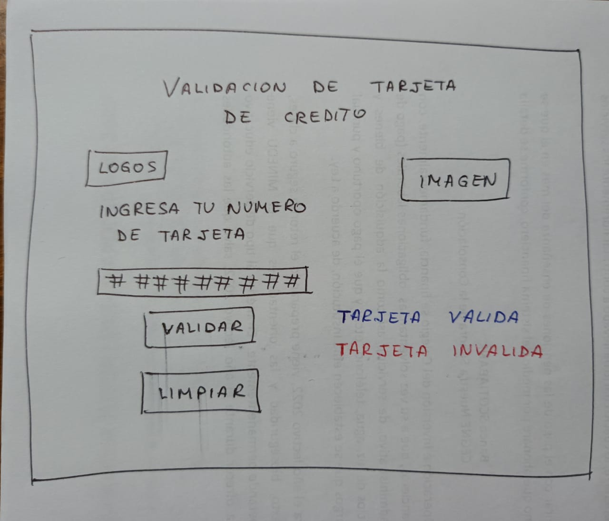

# TARJETA DE CREDITO VALIDA
Este proyecto TARJETA DE CREDITO VALIDA,es creado para facilitar a los pasajeros que hacen uso de los aeropuertos y necesitan hacen transbordo y requieren validar sus tarjetas de credito para realizar la compra de vuelos inmediatos o para aprovrechar descuentos.

* ¿Quiénes son los principales usuarios de producto?
Los viajeros que hacen transbordo en los aeropuertos 

* ¿Cuáles son los objetivos de estos usuarios en relación al producto?
Los viajeros que usan los aeropuertos y hacen transbordo,requieren validar sus tarjetas de credito para realizar compras.

* ¿Cómo crees que el producto que estás creando está resolviendo sus problemas?
Al hacer uso de valida.tu.tarjeta.com, los usuarios validan sus tajetas de credito y pueden realizar compras de vuelos en ofertas y acceder a ellos en menos tiempo.

## Proyecto Final

## Interfaz de usuario (UI)

La interfaz permite al usuario:

* Insertar el número que queremos validar.
* Ver el resultado si es válido o no.
* Ocultar todos los dígitos de su número de tarjeta menos los últimos
4 caracteres.
* No debe poder ingresar un campo vacío.

### UX (Diseño de experiencia de usuario)

* Prototipo con papel y lápiz (blanco y negro).

### Feedback
* Luego pedi feedback a dos compañeras.
* Tomando lo aprendido  mi primer prototipo usando figma (herramienta para diseño de prototipos)

### Prototipo Final
Usando Figma,realicé el prototipo final

  

